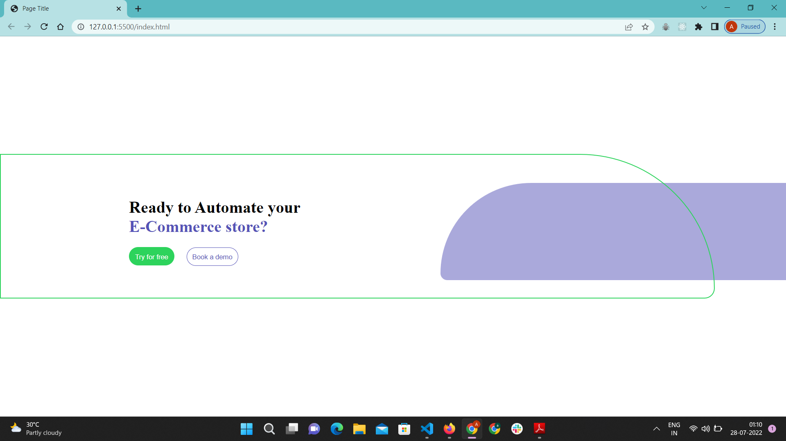

Question 2 :- 
var url_string = "https://www.kommunicate.io/poweredby?utm_source=https://www.kommunicate.io/&utm_medium=webplugin&utm_campaign=poweredby";
	var url = new URL(url_string);
	var c = url.searchParams.get("utm_medium");
	var d = url.searchParams.get("utm_campaign");
	console.log(c);
	console.log(d);
 
Question 3 :- 
function reverse_a_number(n)
	{
		n = n + "";
		return n.split("").reverse().join("");
	}
	console.log(Number(reverse_a_number(149)));
